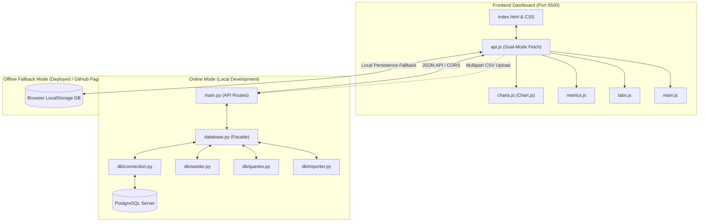
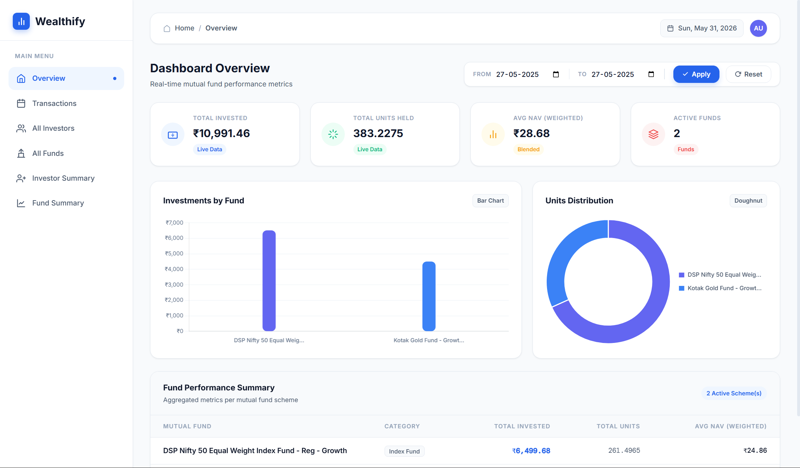
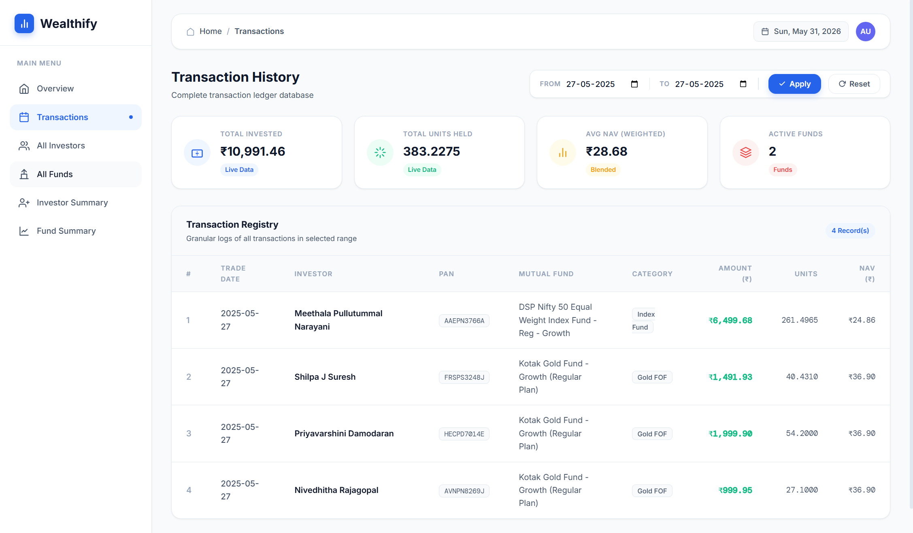
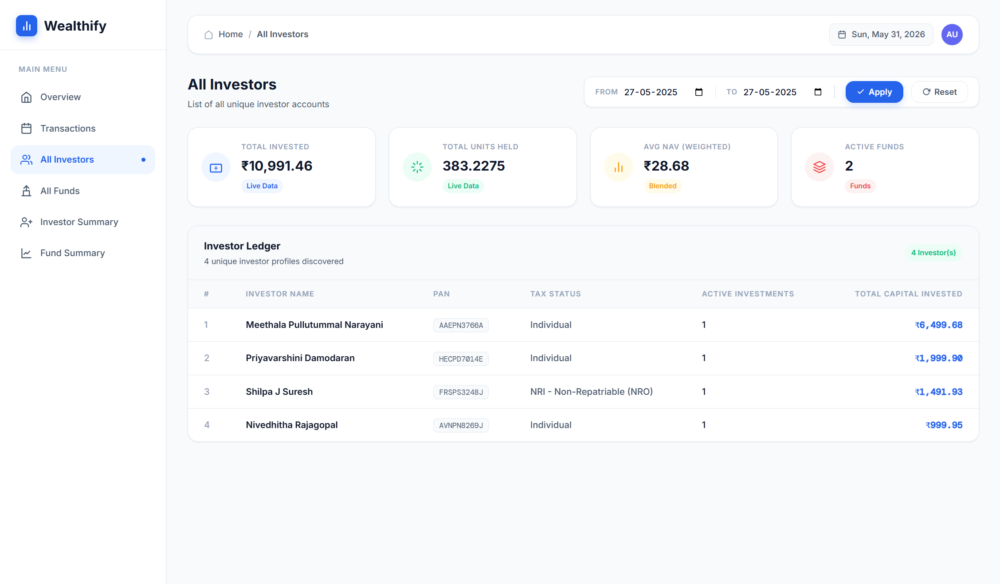
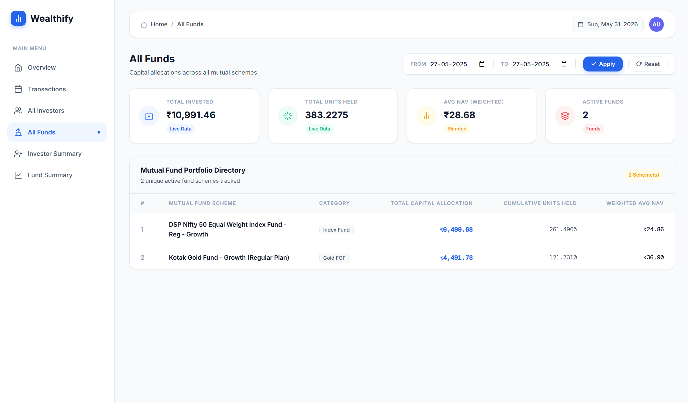
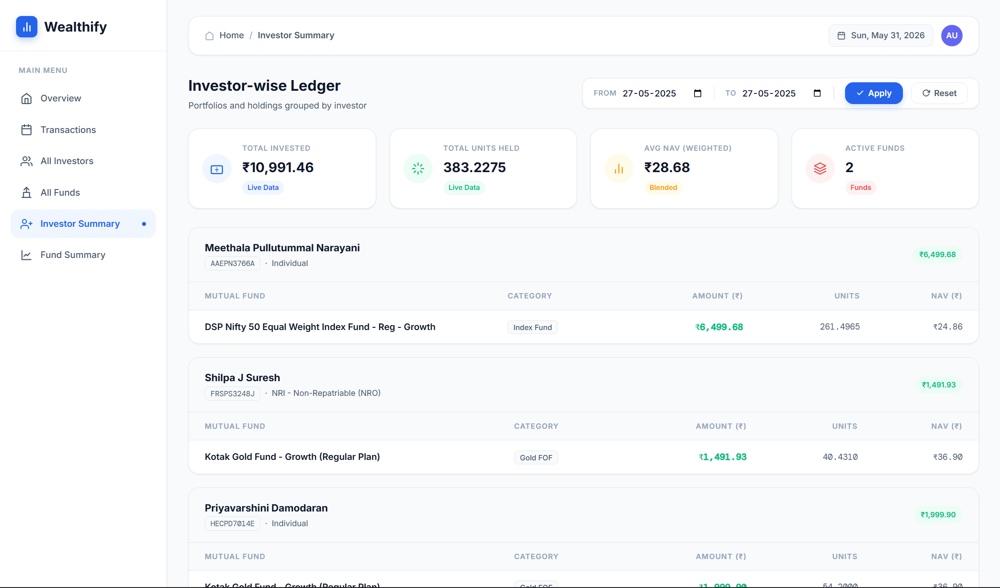
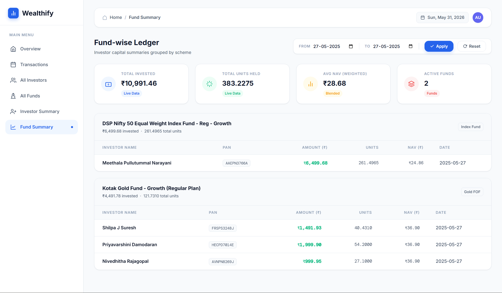
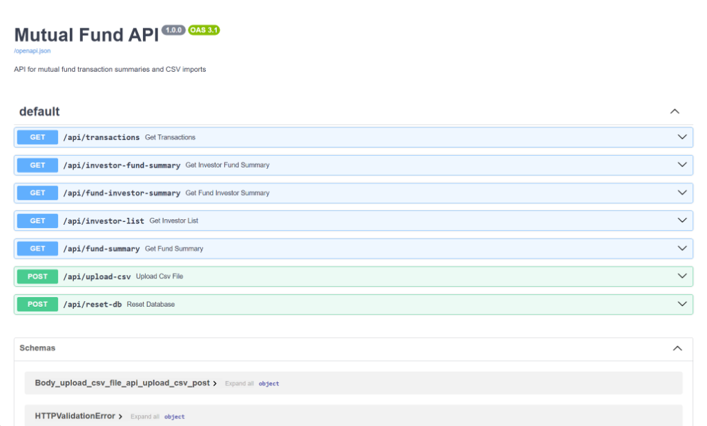

# Wealthify — Mutual Fund Transaction Dashboard 📈

A modern, high-performance web dashboard for tracking mutual fund transaction summaries, powered by a **Python FastAPI** backend, a **PostgreSQL** database, and a clean **HTML, CSS, JS** frontend.

---

## 🏛 System Architecture (Dual-Mode Design)

To ensure the dashboard works in both local and statically deployed environments, it implements a **Dual-Mode Architecture**:

1. **Online Mode (FastAPI + PostgreSQL)**: The dashboard communicates directly with the Python FastAPI backend, persisting and aggregating transactions inside a PostgreSQL database.
2. **Offline Fallback Mode (Browser LocalStorage DB)**: When deployed as a static site (such as on **GitHub Pages**), the frontend automatically detects that the backend is unreachable and switches to a client-side database backed by browser `localStorage`.



---

## 🛠 Prerequisites & Dependencies

To run this application locally, ensure you have the following installed on your system:

| Layer | Tool / Dependency | Version Required | Purpose |
| :--- | :--- | :--- | :--- |
| **System** | [Python](https://www.python.org/downloads/) | `3.9` or higher | Runs the backend and local servers |
| **Database** | [PostgreSQL](https://www.postgresql.org/) | `15` or higher | Robust persistent SQL transaction storage |
| **Backend** | [FastAPI](https://fastapi.tiangolo.com/) | `0.110.0` | High-performance async web framework |
| **Backend** | [Uvicorn](https://www.uvicorn.org/) | `0.28.0` | ASGI web server implementation |
| **Backend** | [psycopg2-binary](https://pypi.org/project/psycopg2-binary/) | `2.9.9` | PostgreSQL database adapter for Python |
| **Backend** | [python-multipart](https://github.com/Kludex/python-multipart) | `0.0.9` | Handles multi-part file uploads (CSV files) |
| **Frontend** | HTML, CSS, JS | Native | Clean, responsive and interactive client-side rendering |
| **Frontend** | [Chart.js](https://www.chartjs.org/) | `4.4.1` (via CDN) | Metric bar and doughnut charts |
| **Frontend** | [Google Fonts](https://fonts.google.com/) | DM Sans & Inter | Sleek typography and layouts |

---

## 📝 Core Assumptions Mapped to the Project

The following architectural and design assumptions were established to guide development:

1. **PostgreSQL Server**: The backend assumes a running PostgreSQL database instance. Connection parameters are read from environment variables (`DB_HOST`, `DB_PORT`, `DB_NAME`, `DB_USER`, `DB_PASSWORD`), falling back to standard defaults (`localhost`, `5432`, `wealthify`, `postgres`, `postgres`).
2. **Database Auto-Initialization**: On backend application startup, database tables (`transactions`) and index structures are automatically initialized and seeded with demo transactions if the database is empty.
3. **Strict Date Normalization**: Transaction dates inside CSV sheets may have varying date format layouts (e.g. `DD/MM/YYYY`, `DD-MM-YYYY`). All date records are strictly normalized to a zero-padded `YYYY-MM-DD` format on import to ensure accurate date-range filtering.
4. **Resilient Local Persistence**: When hosted statically (such as on GitHub Pages), the backend is assumed to be unreachable. The frontend automatically detects this state and falls back to browser `localStorage` to ensure a fully functional offline demo state.
5. **Weighted Average NAV Calculations**: To represent portfolio health accurately, NAV prices are computed as a weighted average: $\sum (\text{NAV} \times \text{units}) / \sum \text{units}$. This represents a blended portfolio NAV in real-time.
6. **Clean Frontend Design**: The frontend interface has a pristine, distraction-free top header that contains only the date badge and user profile avatar. All CSV upload and database reset buttons are excluded from the visual dashboard, while their corresponding backend API endpoints remain active for testing or script integrations.

---

## 🚀 How to Setup & Run

### 1. Database Creation (PostgreSQL)
Ensure your local PostgreSQL server is running and create a database named `wealthify`:
```sql
CREATE DATABASE wealthify;
```

### 2. Manual Startup (Multi-Platform) 💻

#### Setup & Run the Backend
```bash
# 1. Navigate to the backend folder
cd backend

# 2. Create a virtual environment
python -m venv .venv

# 3. Activate the virtual environment
# On Windows (cmd):
.venv\Scripts\activate.bat
# On macOS/Linux/Git Bash:
source .venv/bin/activate

# 4. Install backend dependencies
pip install -r requirements.txt

# 5. Start the FastAPI server
uvicorn main:app --host 127.0.0.1 --port 8000 --reload
```
*The database tables and index structures initialize and seed themselves automatically upon startup.*

Once the server is running, you can access the interactive **Swagger UI** at `http://localhost:8000/docs` to test all API endpoints:


#### Run the Frontend
In a new terminal window, navigate to the root directory and start a local HTTP server:
```bash
# Navigate to project root
cd mutual-fund-dashboard

# Start local server
python -m http.server 5500
```
Open your web browser and navigate to **`http://localhost:5500`**.

---

## 📊 Dashboard Renders & Directory Structure

### 1. Codebase Directory Map
- `backend/db/connection.py`: Standard psycopg2 PostgreSQL connection pooling.
- `backend/db/seeder.py`: PostgreSQL schemas, indexing, and mock seeding.
- `backend/db/queries.py`: PostgreSQL date-filtered SELECT queries.
- `backend/db/importer.py`: Multi-format CSV parser and date normalizer.
- `backend/database.py`: Clean re-exporting facade.
- `js/main.js`: Main initialization and date badges.
- `js/utils.js`: Clean decimal formatting tools.
- `js/api.js`: Resilient dual-mode fetch engine.
- `js/metrics.js`: Real-time weighted average metric calculations.
- `js/charts.js`: Chart.js visualizer configurations.
- `js/tabs.js`: Multi-view content generation routing.

### 2. Dynamic Sidebar Tabs
1. 🏠 **Overview**: Renders KPI metric cards, side-by-side graphical charts, and a "Fund Performance Summary" aggregate table.
2. 📝 **Transactions**: History ledger listing all transaction rows.
3. 👥 **All Investors**: Lists unique investor accounts, tax statuses, transaction counts, and capital sums.
4. 🏛 **All Funds**: Lists active mutual fund schemes, categories, cumulative units, and weighted NAVs.
5. 👤 **Investor Summary**: Grouped detail holdings per individual investor.
6. 📈 **Fund Summary**: Grouped detail holdings per mutual fund scheme.

---

## 📊 Application Output Screens

Below are screenshots of the key screens and views in Wealthify:

### 1. Dashboard Overview
Displays aggregated mutual fund metrics, capital weights, allocations, and fund summaries:


### 2. Transaction History
Complete searchable registry of all mutual fund transaction logs:


### 3. All Investors
Roster of all unique investor profiles with total capital invested and transaction counts:


### 4. All Funds
Directory of active mutual fund schemes, category types, and total allocations:


### 5. Investor-wise Ledger
Detailed portfolio holdings grouped dynamically per investor profile:


### 6. Fund-wise Ledger
Detailed investor contributions and units grouped dynamically per mutual scheme:


### 7. Interactive Swagger API Documentation
FastAPI automatic interactive OpenAPI route and schema documentation:


